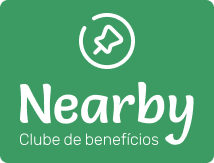
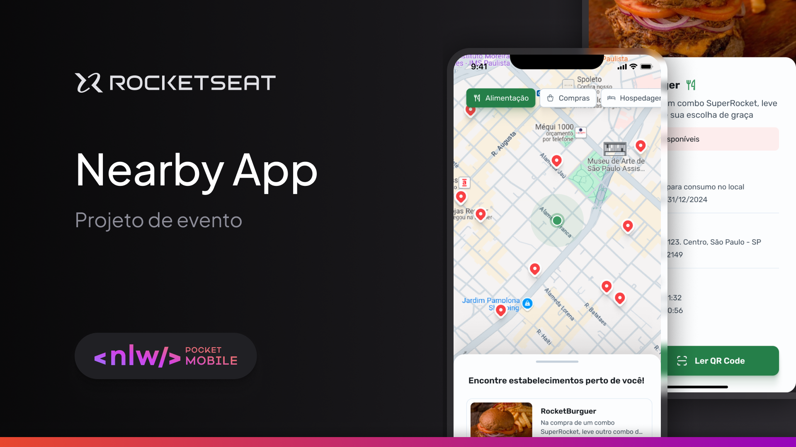
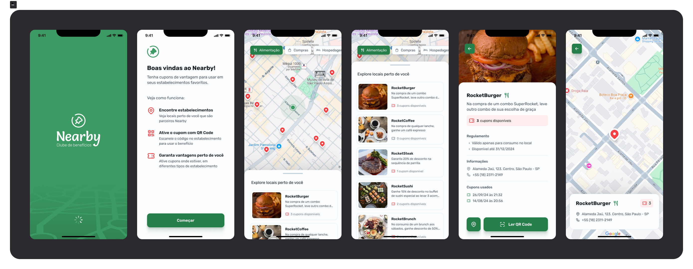

<h1 align="center"> Nearby-App-Mobile 📱 🗺️ </h1>

<p align="center">
  
</p>

- Repository for the Nearby project developed during the NLW mobile week. The project is a mobile benefits club application with coupons to use at establishments near you.

---

<p align="center">
  
</p>

---

## Preview 🖼️

<p align="center">
  
</p>

---


## 🧪 Technologies

This project was developed with the following technologies:

- React Native
- Expo
- Tabler Icons

---

## 🚀 How to run

Clone the repository and access the folder.

### Using npm

Run commands

1) ```npm install```

2) ```npx expo start```

---

## Contributing 🤝

Pull requests are welcome. For major changes, please open an issue first to discuss what you would like to change.

- Please make sure to update tests as appropriate.

---

## License ⚖️

[](http://badges.mit-license.org)

- **[MIT license](https://github.com/GabrielFraga962/Project-NLW-InOrbit/blob/main/LICENSE)**;
- Copyright 2025 © <a href="https://github.com/GabrielFraga962" target="_blank">Gabriel S. Fraga</a>.
